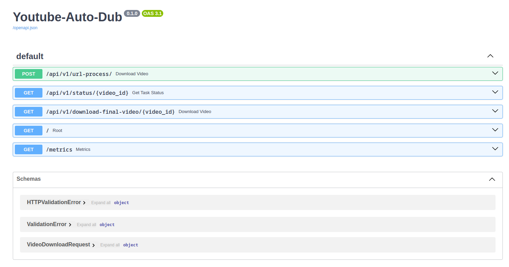

# YouTube Auto-Dub

This repository serves as a starting point for developing a FastAPI backend for dubbing YouTube videos by capturing and inferring the voice timbre using OpenVoice.



## Core Features

- **Voice Timbre Recognition**: Utilizes OpenVoice technology to accurately recognize the voice timbre from the original YouTube video.
- **Text-to-Speech Synthesis**: Downloads and processes subtitles, translating them and converting them into speech, matching the original voice timbre as closely as possible.
- **Flexible Deployment**: Supports deployment via GitHub Actions and Cloud Build, with compatibility for Cloud Run deployment, ensuring scalability and ease of use. Currently, inference is performed using CPU. For setting up Cloud Run with Terraform, refer to the following repository for instructions:

[FastAPI-CloudRun-Starter](https://github.com/mazzasaverio/fastapi-cloudrun-starter)

## Getting Started

To get started with YouTube Auto-Dub, follow these steps:

### 1. Environment Setup

For local development, we recommend setting up a conda environment with:

```bash
conda install mamba -n base -c conda-forge
mamba create -n youtube-auto-dub python=3.9 -y
mamba install -n youtube-auto-dub pytorch==1.13.1 torchvision==0.14.1 torchaudio==0.13.1 pytorch-cuda=11.7 -c pytorch -c nvidia -y
conda activate youtube-auto-dub
pip install -r requirements.txt
```

### 2. Download Required Checkpoints

Download the model checkpoints necessary for voice timbre recognition and synthesis:

```bash
sudo aria2c --console-log-level=error -c -x 16 -s 16 -k 1M https://myshell-public-repo-hosting.s3.amazonaws.com/checkpoints_1226.zip -d /code -o checkpoints_1226.zip
sudo unzip /code/checkpoints_1226.zip -d backend/checkpoints
```

### 3. Running the Application

With the environment set up and checkpoints downloaded, navigate to the backend directory and start the application using:

```bash
cd backend
uvicorn app.main:app --reload
```

## Usage

To use YouTube Auto-Dub, begin by submitting a YouTube link via the endpoint:

```
/api/v1/download/
```

The application will process the video, recognize the voice timbre, translate the subtitles, synthesize the translated speech matching the original timbre, and then assemble the final video. The processed video will be saved in `backend/data/final_videos`. With the video ID returned in the output, you can check the processing status through the endpoint:

```
/api/v1/status/{video_id}
```

Finally, you can download the final video by using the endpoint:

```
/api/v1/download-video/{video_id}
```

inserting the video's ID.

## Deployment

This project is designed with cloud deployment in mind. The provided `cloudbuild.yaml` and Terraform configurations facilitate deployment on Google Cloud Platform, specifically using Cloud Run for scalable, serverless application hosting.

## Contributing

Contributions are welcome! Whether you're fixing a bug, adding new features, or improving the documentation, your help is appreciated. Please feel free to fork the repository and submit pull requests.

## Reference and Inspiration

The development of YouTube Auto-Dub was inspired by the following repository:

- [OpenVoice](https://github.com/myshell-ai/OpenVoice): Instant voice cloning technology by MyShell, utilized for voice timbre recognition and synthesis in this project.

## Future Directions

- **Model Improvements**: Explore and integrate better models for voice recognition and synthesis.
- **Serverless GPU Support**: Investigate options for serverless GPU computing to accelerate processing.
- **Frontend Interface**: Develop a user-friendly frontend for easier interaction with the application.
- **Translation Synchronization**: Enhance the synchronization between translated text and video content for a seamless viewing experience.

## License

This project is licensed under the MIT License - see the LICENSE file for details.
