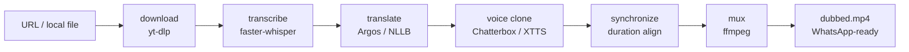

# YouTube Auto-Dub

[](https://github.com/mazzasaverio/youtube-auto-dub/actions/workflows/ci.yml)
[](LICENSE)
[](pyproject.toml)

Take a YouTube video and get **the same video, dubbed into another language in the
original speaker's voice** — then share it straight over WhatsApp/Telegram.

Everything runs **locally and for free** on your own machine. No paid APIs, no cloud
account required. A GPU is used automatically if you have one, but the whole pipeline
works on a CPU-only laptop.

> **v0.2 — full rewrite.** The project was rebuilt around the current open-source
> state of the art (see [What changed](#what-changed-from-v01)). The old v0.1
> Cloud Run / OpenVoice-v1 backend was removed; its code remains in git history.

**Verified end-to-end on CPU (no GPU):** a self-test that generates an Italian clip,
dubs it to English and measures the result gives **0.00 s** timing drift (dub length ==
source length) and **0.888** speaker-timbre cosine similarity (>0.85 ≈ same voice).
Reproduce it with `python examples/selftest_dub.py` (needs the `[xtts]` extra).

## How it works


```mermaid
flowchart LR
    A["URL / local file"] --> B["download<br/>yt-dlp"]
    B --> C["transcribe<br/>faster-whisper"]
    C --> D["translate<br/>Argos / NLLB"]
    D --> E["voice clone<br/>Chatterbox / XTTS"]
    E --> F["synchronize<br/>duration align"]
    F --> G["mux<br/>ffmpeg"]
    G --> H["dubbed.mp4<br/>WhatsApp-ready"]
```

| Stage | Engine | Why |
|---|---|---|
| Download | **yt-dlp** | The only downloader that keeps working as YouTube changes |
| Transcribe | **faster-whisper** (word timestamps) | Precise per-segment timing — trusts the audio, not YouTube captions |
| Translate | **Argos Translate** (offline, default) · NLLB-200 (optional) | Free, local, segment-by-segment |
| Voice clone + TTS | **Chatterbox** (MIT, default) · XTTS-v2 · OpenVoice v2 | Clones the original voice, speaks the target language |
| Synchronize | **Duration alignment** (pitch-preserving time-stretch) | Keeps the dub locked to the video — the piece v0.1 lacked |
| Assemble | **ffmpeg** (H.264 + AAC, `+faststart`) | Share-ready MP4 for messaging apps |

## Quick start

Requires **Python 3.10–3.12** and **ffmpeg** on your PATH
(`sudo apt install ffmpeg` / `brew install ffmpeg`).

```bash
# 1. Install (uv recommended; plain pip works too). The cloning voice is Chatterbox
#    (MIT). For the highest-quality translation add ,nllb (see "Best quality").
uv venv && source .venv/bin/activate
uv pip install -e ".[chatterbox]"

# 2. Dub a video into English (source language auto-detected).
ytdub dub "https://youtu.be/VIDEO_ID" --target en

# 3. Grab the result — ready to send on WhatsApp.
#    data/output/VIDEO_ID.en.mp4   (+ VIDEO_ID.en.srt translated subtitles)
```

Already have the video on disk? Pass a **local file path** instead of a URL — the same
pipeline runs without touching YouTube (great for testing or non-YouTube videos):

```bash
ytdub dub ./my_video.mp4 --target en
```

That's it. The first run downloads the models it needs (Whisper + Chatterbox ≈ 2 GB)
and caches them; later runs are offline.

> **"Sign in to confirm you're not a bot"?** YouTube shows this on some networks
> (datacenters, VPNs, CI — rarely on a home machine). Pass your browser's cookies:
> `ytdub dub URL --cookies-from-browser chrome` (or `--cookies cookies.txt`).

### Common options

```bash
ytdub dub URL --source it --target es          # Italian → Spanish
ytdub dub URL --subtitles                      # burn small translated captions at the bottom
ytdub dub URL --diarize --speakers 2           # multi-voice (one cloned voice per speaker)
ytdub dub URL --translator nllb                # higher-quality translation
ytdub dub URL --asr-model medium               # more accurate transcription
ytdub dub URL --tts xtts                       # faster TTS backend on CPU
ytdub dub URL --reencode                       # force H.264 for max compatibility
ytdub info                                     # show version + detected device
```

### Best quality

For the most fluent result, use a bigger ASR model and the neural translator:

```bash
uv pip install -e ".[chatterbox,nllb]"
ytdub dub URL --asr-model medium --translator nllb
```

Transcription is rebuilt on **sentence boundaries** (from word timestamps), which gives
cleaner translations and more natural timing — on a real 32 s clip this cut the segments
that needed time-stretching from 6/6 down to 1/4.

**Rhythm control (`--target-cps`).** NLLB translation is *length-aware*: each segment gets
a character budget from its time window, and the model's most concise fitting rendering is
chosen so the dub is sped up less. Lower `--target-cps` (default 15) for more concise
translations (looser rhythm), higher for more faithful ones. On a fast English → Italian
clip this cut over-compressed segments from ~86% to ~56%.

### Lip-sync (experimental, open-source)

Make the on-screen mouth match the dub using **Wav2Lip**. It runs in its *own*
environment (its `librosa` pin conflicts with coqui-tts), driven via subprocess:

```bash
# one-time setup, in a separate folder
git clone https://github.com/Rudrabha/Wav2Lip && cd Wav2Lip
python -m venv .venv && . .venv/bin/activate && pip install -r requirements.txt
# download the wav2lip_gan.pth checkpoint into Wav2Lip/checkpoints/ (see their README)

# then point ytdub at it and enable --lipsync
export YTDUB_WAV2LIP_DIR=/path/to/Wav2Lip
export YTDUB_WAV2LIP_CKPT=/path/to/Wav2Lip/checkpoints/wav2lip_gan.pth
export YTDUB_WAV2LIP_PYTHON=/path/to/Wav2Lip/.venv/bin/python
ytdub dub URL --target en --lipsync
```

Wav2Lip is **slow on CPU** — use a GPU. Two ready Colab notebooks (free T4 GPU):
- [`examples/colab_lipsync_only.ipynb`](examples/colab_lipsync_only.ipynb) — **recommended**:
  dub locally, then upload the dubbed MP4 and let Colab do *only* Wav2Lip. Fewest moving
  parts, no heavy install.
- [`examples/colab_lipsync.ipynb`](examples/colab_lipsync.ipynb) — the full pipeline +
  lip-sync on Colab in one go.

### Multi-voice (multiple speakers)

By default the whole video is dubbed in one cloned voice. `--diarize` detects each
speaker and clones a *separate* voice per speaker. Two backends:

```bash
# Token-free (default): speaker-embedding clustering — no gated models, no HF token.
uv pip install -e ".[chatterbox,diarize]"
ytdub dub URL --diarize --speakers 2        # or --speakers 0 to auto-estimate

# Higher accuracy: pyannote (needs a free HF token + one-time terms acceptance).
uv pip install -e ".[chatterbox,diarize-pyannote]"
export HF_TOKEN=hf_xxx                        # after accepting terms at
                                              # hf.co/pyannote/speaker-diarization-3.1
ytdub dub URL --diarize --diarize-method pyannote
```

## No GPU? It still works

The pipeline auto-detects your hardware: with no GPU it simply runs on **CPU** — nothing
to configure. Download, transcription (faster-whisper `int8`), translation (Argos),
synchronization and muxing are all comfortable on a plain laptop.

The one slow part on CPU is the neural **voice cloning (TTS)**. Rule of thumb: short
clips (Shorts, a few minutes) are fine; long videos take a while. To keep CPU snappy:

```bash
ytdub dub URL --asr-model base      # smaller Whisper (tiny/base) = faster ASR
ytdub dub URL --tts xtts            # XTTS is faster than the Chatterbox default on CPU
# keep --translator argos (default); nllb and --diarize add work on CPU
```

**Want a GPU without owning one — for free?** Run it on **Google Colab** or **Kaggle**
(free T4 GPU):
`!pip install "ytdub[chatterbox,nllb] @ git+https://github.com/mazzasaverio/youtube-auto-dub.git"`,
then call `ytdub dub ...` in a cell. The ready-made
[`examples/colab_lipsync.ipynb`](examples/colab_lipsync.ipynb) does the whole pipeline
(and lip-sync) on Colab for you.

## Choosing the engines (all free/open-source)

**Translation**
- `argos` *(default)* — fully offline, tiny models, installs the needed language pair
  on first use. Best for the "works on any PC" promise.
- `nllb` — Meta NLLB-200; noticeably more fluent, heavier (pulls in torch).
  `uv pip install -e ".[nllb]"`.

**Voice cloning / TTS**
- `chatterbox` *(default)* — Chatterbox Multilingual (Resemble AI): **MIT**, clean
  `pip install`, 23 languages, emotion control. On our real test short it improved
  speaker-timbre similarity to the original voice from **0.784 (XTTS) to 0.834** — at the
  cost of being slower on CPU. `uv pip install -e ".[chatterbox]"`.
- `xtts` — Coqui XTTS-v2: 17 languages, CPU-capable and faster than Chatterbox.
  License CPML (free to use; commercial use needs registration). `--tts xtts`.

  **CPU install recipe (verified July 2026, Python 3.11).** coqui-tts is picky about
  its deps; this combination works out of the box on a CPU-only machine:
  ```bash
  uv venv --python 3.11 && source .venv/bin/activate
  uv pip install torch==2.6.0 torchaudio==2.6.0 \
      --index-url https://download.pytorch.org/whl/cpu   # torch < 2.9 avoids torchcodec
  uv pip install -e ".[xtts]"                            # pins transformers<5, numpy<2.1
  ```
  On a CUDA machine, drop the `--index-url` line (use default torch) — torchcodec works
  there. The `[xtts]` extra encodes the transformers/numpy pins so you don't hit them.
- `openvoice` — OpenVoice v2 (MeloTTS + tone-color converter), MIT. **No pip extra**:
  `myshell-openvoice` hard-pins ancient deps (`faster-whisper==0.9.0`, old `av`/`librosa`)
  that don't resolve against a modern stack, so it only works in a **dedicated legacy
  environment** you set up by hand. Prefer `chatterbox`/`xtts`. If you really need it:
  ```bash
  # in a separate venv, not the main one
  pip install --no-deps myshell-openvoice && pip install wavmark "setuptools<80"
  pip install git+https://github.com/myshell-ai/MeloTTS.git && python -m unidic download
  # download the OpenVoice v2 checkpoints, then:
  export YTDUB_OPENVOICE_CKPT=/path/to/checkpoints_v2
  ```

## Optional: run in Docker

```bash
docker build -t ytdub .
docker run --rm -v "$PWD/data:/app/data" ytdub dub "https://youtu.be/VIDEO_ID" -t en
# add `--gpus all` on a CUDA host for acceleration
```

## Optional: run it as a server

```bash
uv pip install -e ".[api,chatterbox]"
uvicorn ytdub.api:app --reload
# POST /dub {"url": "...", "target_lang": "en"} → GET /status/{id} → GET /download/{id}
```

## Configuration

Everything is overridable via CLI flags or `YTDUB_*` env vars (or a `.env` file), e.g.
`YTDUB_TARGET_LANG=es`, `YTDUB_ASR_MODEL=medium`, `YTDUB_MAX_SPEEDUP=1.4`.

## What changed from v0.1

| v0.1 (2024) | v0.2 (state of the art) |
|---|---|
| `pytube` + `youtube-dl` (frequently broken) | `yt-dlp` |
| YouTube captions only (often missing) | `faster-whisper` transcription with word timings |
| `googletrans` (unofficial, whole-text blob) | Argos/NLLB, **sentence-by-sentence**, length-aware |
| OpenVoice **v1** (CPU-only, vendored) | **Chatterbox** (MIT) / XTTS-v2, pluggable, GPU-aware |
| single voice | **multi-voice** — token-free speaker diarization |
| **No timing** — one audio blob glued on | **Duration alignment** per segment |
| conda + miniconda Docker, Cloud Run | plain `pip`/`uv`, local-first CLI |

## Roadmap

- Length-aware translation (ask the MT model for a shorter/longer rendering to fit the
  time window before falling back to time-stretch).
- Reduce tail hallucinations (constrain MT on very short trailing fragments).
- Overlap-aware placement so tightly-packed multi-speaker turns don't collide.
- Package Wav2Lip setup into a one-command helper.

## Reference & inspiration

- [Chatterbox](https://github.com/resemble-ai/chatterbox) · [Coqui XTTS](https://github.com/idiap/coqui-ai-TTS) · [OpenVoice](https://github.com/myshell-ai/OpenVoice)
- [faster-whisper](https://github.com/SYSTRAN/faster-whisper) · [yt-dlp](https://github.com/yt-dlp/yt-dlp) · [Argos Translate](https://github.com/argosopentech/argos-translate) · [NLLB](https://github.com/facebookresearch/fairseq/tree/nllb) · [Wav2Lip](https://github.com/Rudrabha/Wav2Lip)

## License

The **code** is **MIT** — see [`LICENSE`](LICENSE). Do anything you want with it.

The models it *orchestrates* have their own licenses, so mind them for **commercial**
use. The default stack is fully permissive; some optional engines are not:

| Engine | License | Commercial use |
|---|---|---|
| Chatterbox (default TTS) | MIT | ✅ |
| faster-whisper / Whisper | MIT | ✅ |
| Argos Translate (default) | MIT + open model data | ✅ |
| yt-dlp, ffmpeg | Unlicense / LGPL-GPL | ✅ (respect ffmpeg build flags) |
| **NLLB-200** (`--translator nllb`) | **CC-BY-NC 4.0** | ❌ non-commercial |
| **XTTS-v2** (`--tts xtts`) | **Coqui CPML** | ⚠️ needs registration |

**Bottom line:** the default backends (Argos + Chatterbox + Whisper) are safe for
commercial dubbing; if you switch to `nllb` or `xtts`, check their terms.
