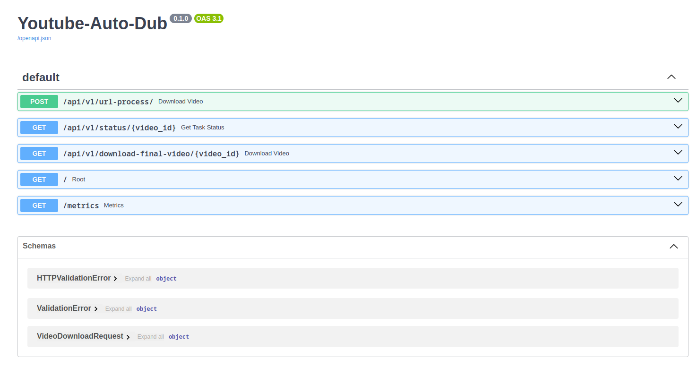

# YouTube Auto-Dub

Take a YouTube video and get **the same video, dubbed into another language in the
original speaker's voice** — then share it straight over WhatsApp/Telegram.

Everything runs **locally and for free** on your own machine. No paid APIs, no cloud
account required. A GPU is used automatically if you have one, but the whole pipeline
works on a CPU-only laptop.

> **v0.2 — full rewrite.** The project was rebuilt around the current open-source
> state of the art (see [What changed](#what-changed-from-v01)). The old v0.1
> Cloud Run / OpenVoice-v1 backend was removed; its code remains in git history.



## How it works

```
 URL ──▶ download ──▶ transcribe ──▶ translate ──▶ voice clone ──▶ synchronize ──▶ mux ──▶ dubbed.mp4
        (yt-dlp)    (faster-whisper)  (Argos/NLLB)   (XTTS-v2 /     (duration        (ffmpeg,
                     word timings                     OpenVoice v2)  alignment)       WhatsApp-ready)
```

| Stage | Engine | Why |
|---|---|---|
| Download | **yt-dlp** | The only downloader that keeps working as YouTube changes |
| Transcribe | **faster-whisper** (word timestamps) | Precise per-segment timing — trusts the audio, not YouTube captions |
| Translate | **Argos Translate** (offline, default) · NLLB-200 (optional) | Free, local, segment-by-segment |
| Voice clone + TTS | **Coqui XTTS-v2** (default) · **OpenVoice v2** (MIT) | Clones the original voice, speaks the target language |
| Synchronize | **Duration alignment** (pitch-preserving time-stretch) | Keeps the dub locked to the video — the piece v0.1 lacked |
| Assemble | **ffmpeg** (H.264 + AAC, `+faststart`) | Share-ready MP4 for messaging apps |

## Quick start

Requires **Python 3.10–3.12** and **ffmpeg** on your PATH
(`sudo apt install ffmpeg` / `brew install ffmpeg`).

```bash
# 1. Install (uv recommended; plain pip works too). XTTS extra = the cloning voice.
uv venv && source .venv/bin/activate
uv pip install -e ".[xtts]"

# 2. Dub a video into English (source language auto-detected).
ytdub dub "https://youtu.be/VIDEO_ID" --target en

# 3. Grab the result — ready to send on WhatsApp.
#    data/output/VIDEO_ID.en.mp4   (+ VIDEO_ID.en.srt translated subtitles)
```

Already have the video on disk? Pass a **local file path** instead of a URL — the same
pipeline runs without touching YouTube (great for testing or non-YouTube videos):

```bash
ytdub dub ./my_video.mp4 --target en
```

That's it. The first run downloads the models it needs (Whisper + XTTS ≈ 2 GB) and
caches them; later runs are offline.

> **"Sign in to confirm you're not a bot"?** YouTube shows this on some networks
> (datacenters, VPNs, CI — rarely on a home machine). Pass your browser's cookies:
> `ytdub dub URL --cookies-from-browser chrome` (or `--cookies cookies.txt`).

### Common options

```bash
ytdub dub URL --source it --target es          # Italian → Spanish
ytdub dub URL --diarize                        # multi-voice (one cloned voice per speaker)
ytdub dub URL --tts openvoice                  # fully-MIT cloning backend
ytdub dub URL --translator nllb                # higher-quality translation
ytdub dub URL --asr-model medium               # more accurate transcription
ytdub dub URL --reencode                       # force H.264 for max compatibility
ytdub info                                     # show version + detected device
```

### Multi-voice (multiple speakers)

By default the whole video is dubbed in one cloned voice. To detect each speaker and
clone a *separate* voice per speaker:

```bash
uv pip install -e ".[xtts,diarize]"
# accept terms at hf.co/pyannote/speaker-diarization-3.1, then:
export HF_TOKEN=hf_xxx
ytdub dub URL --diarize
```

## No GPU? It still works

The pipeline auto-detects your hardware: with no GPU it simply runs on **CPU** — nothing
to configure. Download, transcription (faster-whisper `int8`), translation (Argos),
synchronization and muxing are all comfortable on a plain laptop.

The one slow part on CPU is the neural **voice cloning (TTS)**. Rule of thumb: short
clips (Shorts, a few minutes) are fine; long videos take a while. To keep CPU snappy:

```bash
ytdub dub URL --asr-model base      # smaller Whisper (tiny/base) = faster ASR
ytdub dub URL --tts openvoice       # lighter on CPU than XTTS
# keep --translator argos (default); avoid --nllb and --diarize on CPU
```

**Want a GPU without owning one — for free?** Run it on **Google Colab** or **Kaggle**
(free T4 GPU): create a notebook, `!pip install "ytdub[xtts] @ git+<repo>"`, then call
`ytdub dub ...` in a cell. Same tool, ~real-time. Ask and I'll drop in a ready-to-run
Colab notebook.

## Choosing the engines (all free/open-source)

**Translation**
- `argos` *(default)* — fully offline, tiny models, installs the needed language pair
  on first use. Best for the "works on any PC" promise.
- `nllb` — Meta NLLB-200; noticeably more fluent, heavier (pulls in torch).
  `uv pip install -e ".[nllb]"`.

**Voice cloning / TTS**
- `xtts` *(default)* — Coqui XTTS-v2: one pip install, 17 languages, CPU-capable.
  License CPML (free to use; commercial use needs registration).
- `openvoice` — OpenVoice v2 (MeloTTS + tone-color converter), **MIT** end to end.
  Extra setup:
  ```bash
  uv pip install -e ".[openvoice]"
  python -m unidic download
  # download the OpenVoice v2 checkpoints, then:
  export YTDUB_OPENVOICE_CKPT=/path/to/checkpoints_v2
  ```

## Optional: run in Docker

```bash
docker build -t ytdub .
docker run --rm -v "$PWD/data:/app/data" ytdub dub "https://youtu.be/VIDEO_ID" -t en
# add `--gpus all` on a CUDA host for acceleration
```

## Optional: run it as a server

```bash
uv pip install -e ".[api,xtts]"
uvicorn ytdub.api:app --reload
# POST /dub {"url": "...", "target_lang": "en"} → GET /status/{id} → GET /download/{id}
```

## Configuration

Everything is overridable via CLI flags or `YTDUB_*` env vars (or a `.env` file), e.g.
`YTDUB_TARGET_LANG=es`, `YTDUB_ASR_MODEL=medium`, `YTDUB_MAX_SPEEDUP=1.4`.

## What changed from v0.1

| v0.1 (2024) | v0.2 (state of the art) |
|---|---|
| `pytube` + `youtube-dl` (frequently broken) | `yt-dlp` |
| YouTube captions only (often missing) | `faster-whisper` transcription with word timings |
| `googletrans` (unofficial, whole-text blob) | Argos/NLLB, **segment-by-segment** |
| OpenVoice **v1** (CPU-only, vendored) | XTTS-v2 / OpenVoice **v2**, pluggable, GPU-aware |
| **No timing** — one audio blob glued on | **Duration alignment** per segment |
| conda + miniconda Docker, Cloud Run | plain `pip`/`uv`, local-first CLI |

## Roadmap

- Length-aware translation (ask the MT model for a shorter/longer rendering to fit the
  time window before falling back to time-stretch).
- Burned-in / sidecar translated subtitles.
- Overlap-aware placement so tightly-packed multi-speaker turns don't collide.

## Reference & inspiration

- [OpenVoice](https://github.com/myshell-ai/OpenVoice) · [Coqui XTTS](https://github.com/idiap/coqui-ai-TTS)
- [faster-whisper](https://github.com/SYSTRAN/faster-whisper) · [yt-dlp](https://github.com/yt-dlp/yt-dlp) · [Argos Translate](https://github.com/argosopentech/argos-translate)

## License

MIT — see `LICENSE`. Note the XTTS-v2 model weights ship under Coqui's CPML; use the
`openvoice` backend for a fully-MIT stack.
