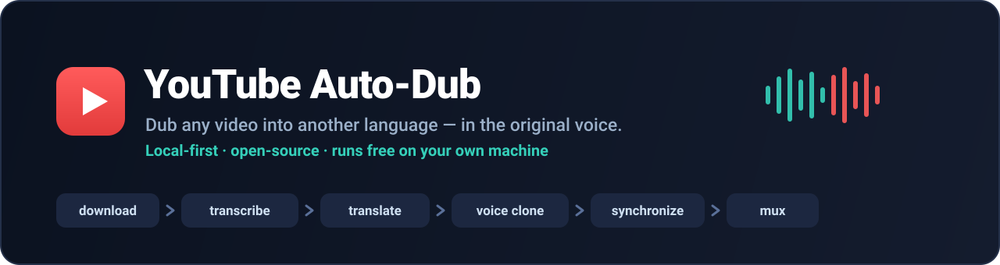
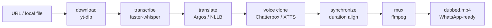

<p align="center">
  
</p>

<p align="center">
  <a href="https://github.com/mazzasaverio/youtube-auto-dub/actions/workflows/ci.yml"></a>
  <a href="LICENSE"></a>
  <a href="pyproject.toml"></a>
</p>

# YouTube Auto-Dub

Prendi un video YouTube e ottieni **lo stesso video, doppiato in un'altra lingua con
la voce del relatore originale**, pronto da condividere su WhatsApp o Telegram.

Tutto funziona **in locale e gratuitamente** sul tuo computer. Non servono API a
pagamento né un account cloud. Se disponibile, la GPU viene usata automaticamente,
ma l'intera pipeline funziona anche su un portatile con sola CPU.

> **v0.2, riscrittura completa.** Il progetto è stato ricostruito attorno allo stato
> dell'arte open source (vedi [Cosa cambia rispetto alla v0.1](#cosa-cambia-rispetto-alla-v01)).
> Il vecchio backend v0.1 basato su Cloud Run / OpenVoice-v1 è stato rimosso, ma il
> suo codice resta nella cronologia Git.

**Verificato end-to-end su CPU, senza GPU:** un test che genera una clip italiana, la
doppia in inglese e ne misura il risultato rileva uno scarto temporale di **0,00 s**
(durata del doppiaggio == durata della sorgente) e una similarità coseno del timbro
vocale di **0,888** (>0,85 indica approssimativamente la stessa voce). Per ripeterlo:
`python examples/selftest_dub.py` (richiede l'extra `[xtts]`).

## Come funziona


```mermaid
flowchart LR
    A["URL / local file"] --> B["download<br/>yt-dlp"]
    B --> C["transcribe<br/>faster-whisper"]
    C --> D["translate<br/>Argos / NLLB"]
    D --> E["voice clone<br/>Chatterbox / XTTS"]
    E --> F["synchronize<br/>duration align"]
    F --> G["mux<br/>ffmpeg"]
    G --> H["dubbed.mp4<br/>WhatsApp-ready"]
```

| Fase | Motore | Motivo |
|---|---|---|
| Download | **yt-dlp** | Il downloader che continua a funzionare mentre YouTube cambia |
| Trascrizione | **faster-whisper** (timestamp delle parole) | Temporizzazione precisa per segmento, basata sull'audio e non sui sottotitoli YouTube |
| Traduzione | **Argos Translate** (offline, predefinito) · NLLB-200 (facoltativo) | Gratuita, locale e segmento per segmento |
| Clonazione vocale + TTS | **Chatterbox** (MIT, predefinito) · XTTS-v2 · OpenVoice v2 | Clona la voce originale e parla nella lingua di destinazione |
| Sincronizzazione | **Allineamento della durata** (time-stretch che preserva l'intonazione) | Mantiene il doppiaggio allineato al video, la parte che mancava nella v0.1 |
| Assemblaggio | **ffmpeg** (H.264 + AAC, `+faststart`) | MP4 pronto da condividere nelle app di messaggistica |

## Avvio rapido

Richiede **Python 3.10–3.12** e **ffmpeg** nel tuo `PATH`
(`sudo apt install ffmpeg` / `brew install ffmpeg`).

```bash
# 1. Installa (consigliato uv, funziona anche pip). La voce da clonare è Chatterbox
#    (MIT). Per la traduzione di maggiore qualità aggiungi ,nllb (vedi "Qualità migliore").
uv venv && source .venv/bin/activate
uv pip install -e ".[chatterbox]"

# 2. Doppi un video in inglese (la lingua sorgente viene rilevata automaticamente).
ytdub dub "https://youtu.be/VIDEO_ID" --target en

# 3. Recupera il risultato, pronto da inviare su WhatsApp.
#    data/output/VIDEO_ID.en.mp4   (+ sottotitoli tradotti VIDEO_ID.en.srt)
```

Hai già il video sul disco? Passa un **percorso a un file locale** anziché un URL: la
stessa pipeline funziona senza contattare YouTube, utile per testare o per video che
non provengono da YouTube.

```bash
ytdub dub ./my_video.mp4 --target en
```

È tutto. La prima esecuzione scarica e memorizza in cache i modelli necessari
(Whisper + Chatterbox, circa 2 GB); le esecuzioni successive sono offline.

> **"Sign in to confirm you're not a bot"?** YouTube può mostrarlo su alcune reti,
> come datacenter, VPN o CI, raramente su una rete domestica. Passa i cookie del browser:
> `ytdub dub URL --cookies-from-browser chrome` (oppure `--cookies cookies.txt`).

### Opzioni comuni

```bash
ytdub dub URL --source it --target es          # italiano → spagnolo
ytdub dub URL --subtitles                      # integra in basso piccoli sottotitoli tradotti
ytdub dub URL --diarize --speakers 2           # più voci, una clonata per relatore
ytdub dub URL --translator nllb                # traduzione di qualità superiore
ytdub dub URL --asr-model medium               # trascrizione più accurata
ytdub dub URL --tts xtts                       # backend TTS più veloce su CPU
ytdub dub URL --reencode                       # forza H.264 per la massima compatibilità
ytdub info                                     # mostra la versione e il dispositivo rilevato
```

### Qualità migliore

Per un risultato più fluido, usa un modello ASR più grande e il traduttore neurale:

```bash
uv pip install -e ".[chatterbox,nllb]"
ytdub dub URL --asr-model medium --translator nllb
```

La trascrizione viene ricostruita sui **confini delle frasi**, a partire dai timestamp
delle parole. Questo produce traduzioni più pulite e una temporizzazione più naturale:
su una clip reale di 32 secondi, i segmenti che richiedevano time-stretching sono passati
da 6 su 6 a 1 su 4.

**Controllo del ritmo (`--target-cps`).** La traduzione NLLB tiene conto della lunghezza:
ogni segmento riceve un budget di caratteri dalla sua finestra temporale e viene scelta
la formulazione più concisa che vi rientra, così il doppiaggio richiede meno accelerazione.
Riduci `--target-cps` (predefinito 15) per traduzioni più concise e un ritmo più libero,
aumentalo per traduzioni più fedeli. Su una clip rapida dall'inglese all'italiano ha ridotto
i segmenti eccessivamente compressi da circa l'86% al 56%.

### Lip-sync (experimental, open-source)

Make the on-screen mouth match the dub using **Wav2Lip**. It runs in its *own*
environment (its `librosa` pin conflicts with coqui-tts), driven via subprocess:

```bash
# one-time setup, in a separate folder
git clone https://github.com/Rudrabha/Wav2Lip && cd Wav2Lip
python -m venv .venv && . .venv/bin/activate && pip install -r requirements.txt
# download the wav2lip_gan.pth checkpoint into Wav2Lip/checkpoints/ (see their README)

# then point ytdub at it and enable --lipsync
export YTDUB_WAV2LIP_DIR=/path/to/Wav2Lip
export YTDUB_WAV2LIP_CKPT=/path/to/Wav2Lip/checkpoints/wav2lip_gan.pth
export YTDUB_WAV2LIP_PYTHON=/path/to/Wav2Lip/.venv/bin/python
ytdub dub URL --target en --lipsync
```

Wav2Lip is **slow on CPU** — use a GPU. Two ready Colab notebooks (free T4 GPU):
- [`examples/colab_lipsync_only.ipynb`](examples/colab_lipsync_only.ipynb) — **recommended**:
  dub locally, then upload the dubbed MP4 and let Colab do *only* Wav2Lip. Fewest moving
  parts, no heavy install.
- [`examples/colab_lipsync.ipynb`](examples/colab_lipsync.ipynb) — the full pipeline +
  lip-sync on Colab in one go.

### Multi-voice (multiple speakers)

By default the whole video is dubbed in one cloned voice. `--diarize` detects each
speaker and clones a *separate* voice per speaker. Two backends:

```bash
# Token-free (default): speaker-embedding clustering — no gated models, no HF token.
uv pip install -e ".[chatterbox,diarize]"
ytdub dub URL --diarize --speakers 2        # or --speakers 0 to auto-estimate

# Higher accuracy: pyannote (needs a free HF token + one-time terms acceptance).
uv pip install -e ".[chatterbox,diarize-pyannote]"
export HF_TOKEN=hf_xxx                        # after accepting terms at
                                              # hf.co/pyannote/speaker-diarization-3.1
ytdub dub URL --diarize --diarize-method pyannote
```

## No GPU? It still works

The pipeline auto-detects your hardware: with no GPU it simply runs on **CPU** — nothing
to configure. Download, transcription (faster-whisper `int8`), translation (Argos),
synchronization and muxing are all comfortable on a plain laptop.

The one slow part on CPU is the neural **voice cloning (TTS)**. Rule of thumb: short
clips (Shorts, a few minutes) are fine; long videos take a while. To keep CPU snappy:

```bash
ytdub dub URL --asr-model base      # smaller Whisper (tiny/base) = faster ASR
ytdub dub URL --tts xtts            # XTTS is faster than the Chatterbox default on CPU
# keep --translator argos (default); nllb and --diarize add work on CPU
```

**Want a GPU without owning one — for free?** Run it on **Google Colab** or **Kaggle**
(free T4 GPU):
`!pip install "ytdub[chatterbox,nllb] @ git+https://github.com/mazzasaverio/youtube-auto-dub.git"`,
then call `ytdub dub ...` in a cell. The ready-made
[`examples/colab_lipsync.ipynb`](examples/colab_lipsync.ipynb) does the whole pipeline
(and lip-sync) on Colab for you.

## Choosing the engines (all free/open-source)

**Translation**
- `argos` *(default)* — fully offline, tiny models, installs the needed language pair
  on first use. Best for the "works on any PC" promise.
- `nllb` — Meta NLLB-200; noticeably more fluent, heavier (pulls in torch).
  `uv pip install -e ".[nllb]"`.

**Voice cloning / TTS**
- `chatterbox` *(default)* — Chatterbox Multilingual (Resemble AI): **MIT**, clean
  `pip install`, 23 languages, emotion control. On our real test short it improved
  speaker-timbre similarity to the original voice from **0.784 (XTTS) to 0.834** — at the
  cost of being slower on CPU. `uv pip install -e ".[chatterbox]"`.
- `xtts` — Coqui XTTS-v2: 17 languages, CPU-capable and faster than Chatterbox.
  License CPML (free to use; commercial use needs registration). `--tts xtts`.

  **CPU install recipe (verified July 2026, Python 3.11).** coqui-tts is picky about
  its deps; this combination works out of the box on a CPU-only machine:
  ```bash
  uv venv --python 3.11 && source .venv/bin/activate
  uv pip install torch==2.6.0 torchaudio==2.6.0 \
      --index-url https://download.pytorch.org/whl/cpu   # torch < 2.9 avoids torchcodec
  uv pip install -e ".[xtts]"                            # pins transformers<5, numpy<2.1
  ```
  On a CUDA machine, drop the `--index-url` line (use default torch) — torchcodec works
  there. The `[xtts]` extra encodes the transformers/numpy pins so you don't hit them.
- `openvoice` — OpenVoice v2 (MeloTTS + tone-color converter), MIT. **No pip extra**:
  `myshell-openvoice` hard-pins ancient deps (`faster-whisper==0.9.0`, old `av`/`librosa`)
  that don't resolve against a modern stack, so it only works in a **dedicated legacy
  environment** you set up by hand. Prefer `chatterbox`/`xtts`. If you really need it:
  ```bash
  # in a separate venv, not the main one
  pip install --no-deps myshell-openvoice && pip install wavmark "setuptools<80"
  pip install git+https://github.com/myshell-ai/MeloTTS.git && python -m unidic download
  # download the OpenVoice v2 checkpoints, then:
  export YTDUB_OPENVOICE_CKPT=/path/to/checkpoints_v2
  ```

## Optional: run in Docker

```bash
docker build -t ytdub .
docker run --rm -v "$PWD/data:/app/data" ytdub dub "https://youtu.be/VIDEO_ID" -t en
# add `--gpus all` on a CUDA host for acceleration
```

## Optional: run it as a server

```bash
uv pip install -e ".[api,chatterbox]"
uvicorn ytdub.api:app --reload
# POST /dub {"url": "...", "target_lang": "en"} → GET /status/{id} → GET /download/{id}
```

## Configuration

Everything is overridable via CLI flags or `YTDUB_*` env vars (or a `.env` file), e.g.
`YTDUB_TARGET_LANG=es`, `YTDUB_ASR_MODEL=medium`, `YTDUB_MAX_SPEEDUP=1.4`.

## What changed from v0.1

| v0.1 (2024) | v0.2 (state of the art) |
|---|---|
| `pytube` + `youtube-dl` (frequently broken) | `yt-dlp` |
| YouTube captions only (often missing) | `faster-whisper` transcription with word timings |
| `googletrans` (unofficial, whole-text blob) | Argos/NLLB, **sentence-by-sentence**, length-aware |
| OpenVoice **v1** (CPU-only, vendored) | **Chatterbox** (MIT) / XTTS-v2, pluggable, GPU-aware |
| single voice | **multi-voice** — token-free speaker diarization |
| **No timing** — one audio blob glued on | **Duration alignment** per segment |
| conda + miniconda Docker, Cloud Run | plain `pip`/`uv`, local-first CLI |

## Roadmap

- Length-aware translation (ask the MT model for a shorter/longer rendering to fit the
  time window before falling back to time-stretch).
- Reduce tail hallucinations (constrain MT on very short trailing fragments).
- Overlap-aware placement so tightly-packed multi-speaker turns don't collide.
- Package Wav2Lip setup into a one-command helper.

## Reference & inspiration

- [Chatterbox](https://github.com/resemble-ai/chatterbox) · [Coqui XTTS](https://github.com/idiap/coqui-ai-TTS) · [OpenVoice](https://github.com/myshell-ai/OpenVoice)
- [faster-whisper](https://github.com/SYSTRAN/faster-whisper) · [yt-dlp](https://github.com/yt-dlp/yt-dlp) · [Argos Translate](https://github.com/argosopentech/argos-translate) · [NLLB](https://github.com/facebookresearch/fairseq/tree/nllb) · [Wav2Lip](https://github.com/Rudrabha/Wav2Lip)

## License

The **code** is **MIT** — see [`LICENSE`](LICENSE). Do anything you want with it.

The models it *orchestrates* have their own licenses, so mind them for **commercial**
use. The default stack is fully permissive; some optional engines are not:

| Engine | License | Commercial use |
|---|---|---|
| Chatterbox (default TTS) | MIT | ✅ |
| faster-whisper / Whisper | MIT | ✅ |
| Argos Translate (default) | MIT + open model data | ✅ |
| yt-dlp, ffmpeg | Unlicense / LGPL-GPL | ✅ (respect ffmpeg build flags) |
| **NLLB-200** (`--translator nllb`) | **CC-BY-NC 4.0** | ❌ non-commercial |
| **XTTS-v2** (`--tts xtts`) | **Coqui CPML** | ⚠️ needs registration |

**Bottom line:** the default backends (Argos + Chatterbox + Whisper) are safe for
commercial dubbing; if you switch to `nllb` or `xtts`, check their terms.
