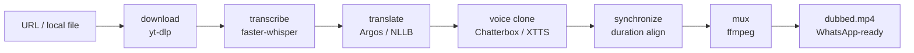

<p align="center">
  
</p>

<p align="center">
  <a href="https://github.com/mazzasaverio/youtube-auto-dub/actions/workflows/ci.yml"></a>
  <a href="LICENSE"></a>
  <a href="pyproject.toml"></a>
</p>

# YouTube Auto-Dub

Prendi un video YouTube e ottieni **lo stesso video, doppiato in un'altra lingua con
la voce del relatore originale**, pronto da condividere su WhatsApp o Telegram.

Tutto funziona **in locale e gratuitamente** sul tuo computer. Non servono API a
pagamento né un account cloud. Se disponibile, la GPU viene usata automaticamente,
ma l'intera pipeline funziona anche su un portatile con sola CPU.

> **v0.2, riscrittura completa.** Il progetto è stato ricostruito attorno allo stato
> dell'arte open source (vedi [Cosa cambia rispetto alla v0.1](#cosa-cambia-rispetto-alla-v01)).
> Il vecchio backend v0.1 basato su Cloud Run / OpenVoice-v1 è stato rimosso, ma il
> suo codice resta nella cronologia Git.

**Verificato end-to-end su CPU, senza GPU:** un test che genera una clip italiana, la
doppia in inglese e ne misura il risultato rileva uno scarto temporale di **0,00 s**
(durata del doppiaggio == durata della sorgente) e una similarità coseno del timbro
vocale di **0,888** (>0,85 indica approssimativamente la stessa voce). Per ripeterlo:
`python examples/selftest_dub.py` (richiede l'extra `[xtts]`).

## Come funziona


```mermaid
flowchart LR
    A["URL / local file"] --> B["download<br/>yt-dlp"]
    B --> C["transcribe<br/>faster-whisper"]
    C --> D["translate<br/>Argos / NLLB"]
    D --> E["voice clone<br/>Chatterbox / XTTS"]
    E --> F["synchronize<br/>duration align"]
    F --> G["mux<br/>ffmpeg"]
    G --> H["dubbed.mp4<br/>WhatsApp-ready"]
```

| Fase | Motore | Motivo |
|---|---|---|
| Download | **yt-dlp** | Il downloader che continua a funzionare mentre YouTube cambia |
| Trascrizione | **faster-whisper** (timestamp delle parole) | Temporizzazione precisa per segmento, basata sull'audio e non sui sottotitoli YouTube |
| Traduzione | **Argos Translate** (offline, predefinito) · NLLB-200 (facoltativo) | Gratuita, locale e segmento per segmento |
| Clonazione vocale + TTS | **Chatterbox** (MIT, predefinito) · XTTS-v2 · OpenVoice v2 | Clona la voce originale e parla nella lingua di destinazione |
| Sincronizzazione | **Allineamento della durata** (time-stretch che preserva l'intonazione) | Mantiene il doppiaggio allineato al video, la parte che mancava nella v0.1 |
| Assemblaggio | **ffmpeg** (H.264 + AAC, `+faststart`) | MP4 pronto da condividere nelle app di messaggistica |

## Avvio rapido

Richiede **Python 3.10–3.12** e **ffmpeg** nel tuo `PATH`
(`sudo apt install ffmpeg` / `brew install ffmpeg`).

```bash
# 1. Installa (consigliato uv, funziona anche pip). La voce da clonare è Chatterbox
#    (MIT). Per la traduzione di maggiore qualità aggiungi ,nllb (vedi "Qualità migliore").
uv venv && source .venv/bin/activate
uv pip install -e ".[chatterbox]"

# 2. Doppi un video in inglese (la lingua sorgente viene rilevata automaticamente).
ytdub dub "https://youtu.be/VIDEO_ID" --target en

# 3. Recupera il risultato, pronto da inviare su WhatsApp.
#    data/output/VIDEO_ID.en.mp4   (+ sottotitoli tradotti VIDEO_ID.en.srt)
```

Hai già il video sul disco? Passa un **percorso a un file locale** anziché un URL: la
stessa pipeline funziona senza contattare YouTube, utile per testare o per video che
non provengono da YouTube.

```bash
ytdub dub ./my_video.mp4 --target en
```

È tutto. La prima esecuzione scarica e memorizza in cache i modelli necessari
(Whisper + Chatterbox, circa 2 GB); le esecuzioni successive sono offline.

> **"Sign in to confirm you're not a bot"?** YouTube può mostrarlo su alcune reti,
> come datacenter, VPN o CI, raramente su una rete domestica. Passa i cookie del browser:
> `ytdub dub URL --cookies-from-browser chrome` (oppure `--cookies cookies.txt`).

### Opzioni comuni

```bash
ytdub dub URL --source it --target es          # italiano → spagnolo
ytdub dub URL --subtitles                      # integra in basso piccoli sottotitoli tradotti
ytdub dub URL --diarize --speakers 2           # più voci, una clonata per relatore
ytdub dub URL --translator nllb                # traduzione di qualità superiore
ytdub dub URL --asr-model medium               # trascrizione più accurata
ytdub dub URL --tts xtts                       # backend TTS più veloce su CPU
ytdub dub URL --reencode                       # forza H.264 per la massima compatibilità
ytdub info                                     # mostra la versione e il dispositivo rilevato
```

### Qualità migliore

Per un risultato più fluido, usa un modello ASR più grande e il traduttore neurale:

```bash
uv pip install -e ".[chatterbox,nllb]"
ytdub dub URL --asr-model medium --translator nllb
```

La trascrizione viene ricostruita sui **confini delle frasi**, a partire dai timestamp
delle parole. Questo produce traduzioni più pulite e una temporizzazione più naturale:
su una clip reale di 32 secondi, i segmenti che richiedevano time-stretching sono passati
da 6 su 6 a 1 su 4.

**Controllo del ritmo (`--target-cps`).** La traduzione NLLB tiene conto della lunghezza:
ogni segmento riceve un budget di caratteri dalla sua finestra temporale e viene scelta
la formulazione più concisa che vi rientra, così il doppiaggio richiede meno accelerazione.
Riduci `--target-cps` (predefinito 15) per traduzioni più concise e un ritmo più libero,
aumentalo per traduzioni più fedeli. Su una clip rapida dall'inglese all'italiano ha ridotto
i segmenti eccessivamente compressi da circa l'86% al 56%.

### Sincronizzazione labiale (sperimentale, open source)

Fai coincidere il movimento della bocca sullo schermo con il doppiaggio usando
**Wav2Lip**. Viene eseguito nel suo *ambiente* dedicato, perché il suo vincolo su
`librosa` è incompatibile con coqui-tts, ed è avviato tramite sottoprocesso:

```bash
# configurazione una tantum, in una cartella separata
git clone https://github.com/Rudrabha/Wav2Lip && cd Wav2Lip
python -m venv .venv && . .venv/bin/activate && pip install -r requirements.txt
# scarica il checkpoint wav2lip_gan.pth in Wav2Lip/checkpoints/ (vedi il loro README)

# poi indica quel percorso a ytdub e abilita --lipsync
export YTDUB_WAV2LIP_DIR=/path/to/Wav2Lip
export YTDUB_WAV2LIP_CKPT=/path/to/Wav2Lip/checkpoints/wav2lip_gan.pth
export YTDUB_WAV2LIP_PYTHON=/path/to/Wav2Lip/.venv/bin/python
ytdub dub URL --target en --lipsync
```

Wav2Lip è **lento su CPU**, quindi usa una GPU. Sono disponibili due notebook Colab
pronti all'uso, con GPU T4 gratuita:
- [`examples/colab_lipsync_only.ipynb`](examples/colab_lipsync_only.ipynb), **consigliato**:
  esegui il doppiaggio in locale, carica poi l'MP4 doppiato e lascia che Colab esegua
  soltanto Wav2Lip. È il percorso con meno componenti e senza installazioni pesanti.
- [`examples/colab_lipsync.ipynb`](examples/colab_lipsync.ipynb): l'intera pipeline,
  inclusa la sincronizzazione labiale, su Colab in un solo passaggio.

### Più voci (più relatori)

Per impostazione predefinita, l'intero video viene doppiato con una sola voce clonata.
`--diarize` rileva ogni relatore e clona una voce *separata* per ciascuno. Sono disponibili
due backend:

```bash
# Senza token (predefinito): clustering degli embedding vocali, senza modelli protetti né token HF.
uv pip install -e ".[chatterbox,diarize]"
ytdub dub URL --diarize --speakers 2        # oppure --speakers 0 per la stima automatica

# Maggiore accuratezza: pyannote richiede un token HF gratuito e l'accettazione una tantum dei termini.
uv pip install -e ".[chatterbox,diarize-pyannote]"
export HF_TOKEN=hf_xxx                        # dopo aver accettato i termini su
                                              # hf.co/pyannote/speaker-diarization-3.1
ytdub dub URL --diarize --diarize-method pyannote
```

## Senza GPU? Funziona comunque

La pipeline rileva automaticamente l'hardware: senza GPU funziona semplicemente su
**CPU**, senza alcuna configurazione. Download, trascrizione con faster-whisper `int8`,
traduzione con Argos, sincronizzazione e multiplexing funzionano bene su un normale
portatile.

La parte lenta su CPU è la **clonazione vocale neurale (TTS)**. In generale, clip brevi,
come gli Shorts o pochi minuti di video, non creano problemi, mentre i video lunghi
richiedono tempo. Per mantenere rapida l'esecuzione su CPU:

```bash
ytdub dub URL --asr-model base      # Whisper più piccolo (tiny/base) = ASR più veloce
ytdub dub URL --tts xtts            # XTTS è più veloce del Chatterbox predefinito su CPU
# mantieni --translator argos (predefinito); nllb e --diarize aumentano il lavoro su CPU
```

**Vuoi una GPU gratuita senza possederne una?** Esegui il progetto su **Google Colab**
o **Kaggle**, che offrono una GPU T4 gratuita:
`!pip install "ytdub[chatterbox,nllb] @ git+https://github.com/mazzasaverio/youtube-auto-dub.git"`,
poi richiama `ytdub dub ...` in una cella. Il notebook pronto
[`examples/colab_lipsync.ipynb`](examples/colab_lipsync.ipynb) esegue per te l'intera
pipeline, inclusa la sincronizzazione labiale, su Colab.

## Scegliere i motori (tutti gratuiti e open source)

**Traduzione**
- `argos` *(predefinito)*: completamente offline, con modelli piccoli; installa la coppia
  linguistica necessaria al primo utilizzo. È la scelta migliore per la promessa di
  funzionare su qualunque PC.
- `nllb`: Meta NLLB-200, sensibilmente più fluido ma più pesante perché include torch.
  `uv pip install -e ".[nllb]"`.

**Clonazione vocale / TTS**
- `chatterbox` *(predefinito)*: Chatterbox Multilingual di Resemble AI, con licenza
  **MIT**, installazione `pip` pulita, 23 lingue e controllo dell'emozione. In un test
  reale su uno Short, ha portato la similarità del timbro del relatore con la voce
  originale da **0,784 con XTTS a 0,834**, ma è più lento su CPU.
  `uv pip install -e ".[chatterbox]"`.
- `xtts`: Coqui XTTS-v2, con 17 lingue, utilizzabile su CPU e più veloce di Chatterbox.
  Licenza CPML, utilizzabile gratuitamente ma con registrazione per l'uso commerciale.
  `--tts xtts`.

  **Procedura di installazione su CPU, verificata a luglio 2026 con Python 3.11.**
  coqui-tts è selettivo sulle dipendenze; questa combinazione funziona direttamente
  su una macchina con sola CPU:
  ```bash
  uv venv --python 3.11 && source .venv/bin/activate
  uv pip install torch==2.6.0 torchaudio==2.6.0 \
      --index-url https://download.pytorch.org/whl/cpu   # torch < 2.9 evita torchcodec
  uv pip install -e ".[xtts]"                            # vincola transformers<5, numpy<2.1
  ```
  Su una macchina CUDA, ometti la riga `--index-url` e usa torch predefinito, perché
  torchcodec vi funziona. L'extra `[xtts]` codifica i vincoli su transformers e numpy.
- `openvoice`: OpenVoice v2 (MeloTTS + convertitore del colore tonale), MIT. **Nessun
  extra pip**: `myshell-openvoice` impone dipendenze molto vecchie
  (`faster-whisper==0.9.0`, versioni precedenti di `av` e `librosa`) che non si risolvono
  con uno stack moderno. Funziona quindi soltanto in un **ambiente legacy dedicato**,
  configurato manualmente. Preferisci `chatterbox` o `xtts`. Se ne hai davvero bisogno:
  ```bash
  # in un venv separato, non in quello principale
  pip install --no-deps myshell-openvoice && pip install wavmark "setuptools<80"
  pip install git+https://github.com/myshell-ai/MeloTTS.git && python -m unidic download
  # scarica i checkpoint di OpenVoice v2, poi:
  export YTDUB_OPENVOICE_CKPT=/path/to/checkpoints_v2
  ```

## Facoltativo: esecuzione in Docker

```bash
docker build -t ytdub .
docker run --rm -v "$PWD/data:/app/data" ytdub dub "https://youtu.be/VIDEO_ID" -t en
# aggiungi `--gpus all` su un host CUDA per l'accelerazione
```

## Facoltativo: esecuzione come server

```bash
uv pip install -e ".[api,chatterbox]"
uvicorn ytdub.api:app --reload
# POST /dub {"url": "...", "target_lang": "en"} → GET /status/{id} → GET /download/{id}
```

## Configurazione

Ogni impostazione può essere sovrascritta con flag della CLI, variabili d'ambiente
`YTDUB_*` o un file `.env`, per esempio
`YTDUB_TARGET_LANG=es`, `YTDUB_ASR_MODEL=medium`, `YTDUB_MAX_SPEEDUP=1.4`.

## Cosa cambia rispetto alla v0.1

| v0.1 (2024) | v0.2 (stato dell'arte) |
|---|---|
| `pytube` + `youtube-dl` (spesso non funzionanti) | `yt-dlp` |
| Solo sottotitoli YouTube (spesso assenti) | Trascrizione `faster-whisper` con timestamp delle parole |
| `googletrans` (non ufficiale, blocco di testo intero) | Argos/NLLB, **frase per frase** e sensibile alla lunghezza |
| OpenVoice **v1** (solo CPU, incluso nel repository) | **Chatterbox** (MIT) / XTTS-v2, sostituibili e consapevoli della GPU |
| Voce singola | **Più voci**, diarizzazione dei relatori senza token |
| **Nessuna temporizzazione**, un unico blocco audio incollato | **Allineamento della durata** per segmento |
| conda + Docker miniconda, Cloud Run | CLI `pip`/`uv` semplice, in locale prima di tutto |

## Roadmap

- Traduzione sensibile alla lunghezza: chiedere al modello MT una formulazione più corta
  o più lunga per entrare nella finestra temporale prima di ricorrere al time-stretch.
- Ridurre le allucinazioni finali, vincolando il modello MT sui frammenti conclusivi molto brevi.
- Posizionamento consapevole delle sovrapposizioni, così gli interventi ravvicinati di più
  relatori non collidono.
- Racchiudere la configurazione di Wav2Lip in un aiuto eseguibile con un solo comando.

## Riferimenti e ispirazione

- [Chatterbox](https://github.com/resemble-ai/chatterbox) · [Coqui XTTS](https://github.com/idiap/coqui-ai-TTS) · [OpenVoice](https://github.com/myshell-ai/OpenVoice)
- [faster-whisper](https://github.com/SYSTRAN/faster-whisper) · [yt-dlp](https://github.com/yt-dlp/yt-dlp) · [Argos Translate](https://github.com/argosopentech/argos-translate) · [NLLB](https://github.com/facebookresearch/fairseq/tree/nllb) · [Wav2Lip](https://github.com/Rudrabha/Wav2Lip)

## Licenza

Il **codice** è distribuito con licenza **MIT**, vedi [`LICENSE`](LICENSE). Puoi usarlo
come preferisci.

I modelli che il progetto *orchestra* hanno licenze proprie, da considerare per l'uso
**commerciale**. Lo stack predefinito è pienamente permissivo, alcuni motori facoltativi
non lo sono:

| Motore | Licenza | Uso commerciale |
|---|---|---|
| Chatterbox (default TTS) | MIT | ✅ |
| faster-whisper / Whisper | MIT | ✅ |
| Argos Translate (default) | MIT + open model data | ✅ |
| yt-dlp, ffmpeg | Unlicense / LGPL-GPL | ✅ (rispetta i flag di compilazione di ffmpeg) |
| **NLLB-200** (`--translator nllb`) | **CC-BY-NC 4.0** | ❌ non commerciale |
| **XTTS-v2** (`--tts xtts`) | **Coqui CPML** | ⚠️ richiede registrazione |

**Conclusione:** i backend predefiniti (Argos + Chatterbox + Whisper) sono adatti al
doppiaggio commerciale. Se passi a `nllb` o `xtts`, verifica i rispettivi termini.
